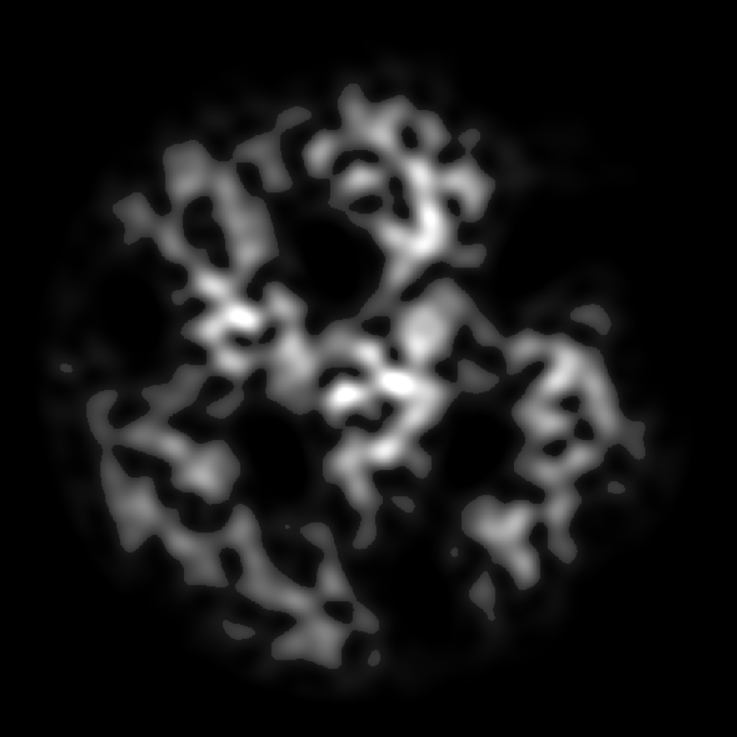
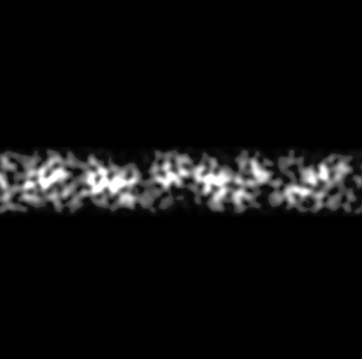

# Plater library!

Intended for world gen.

```lua
-- EXAMPLE: 
-- (may be using outdated API)

local warp = plater.Falloff(0.45)
    :multiply(2)

local simplex = plater.SimplexLayer(15)
    :add(0.1)

local simplex2 = plater.SimplexLayer(10)
    :add(0.1)
    :multiply(2)

return simplex:multiply(warp):multiply(simplex2)
    :apply(function(x)
        if x > 0.1 then
            return x * 2
        end
        return x
    end)

```

<br/>
<br/>
<br/>

# Cave generation:


----

<br/>
<br/>

# Cave tunnel:

